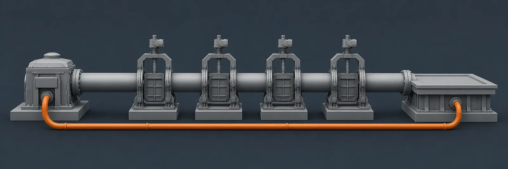
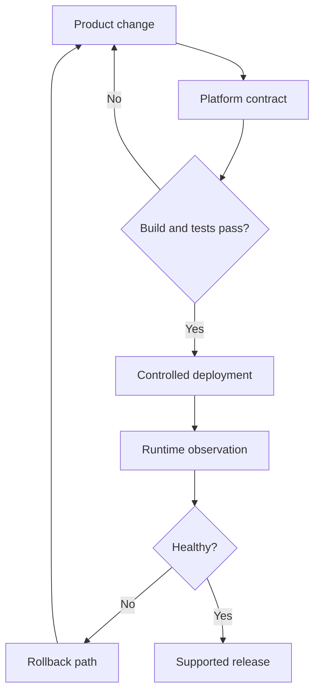

[← All systems](https://github.com/J0UH) · [Product engineering](https://github.com/J0UH/product-engineering)

  

# Developer platform and delivery

Delivery infrastructure is product infrastructure. Teams move faster when APIs, environments, deployments, logs, decisions, and recovery paths form one understandable system.

## The engineering problem

The platform work spanned several generations of services and deployment models. The challenge was reducing one-off knowledge while keeping enough flexibility for experiments, migrations, and live financial products.

## What the system covers

- API and service foundations
- Architectural decision records
- Environment and deployment automation
- Proxies, integration tools, and migration support
- Bug and release workflows
- Observability and operational recovery

## System shape

## Build notes

- Write down the tradeoff when a decision changes the shape of future work.
- Make the supported path easy and the exceptional path visible.
- Optimise for recovery time, not only deployment speed.

Public overview only. Source code, customer data, credentials, and private operating details are not included.

## Talk through a similar problem

Working on something similar? [Tell me about it](mailto:ju@jomena.group?subject=Developer%20platform%20and%20delivery).
