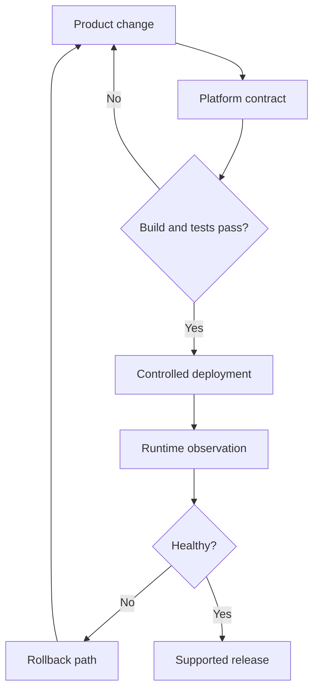

[← Profile](https://github.com/J0UH) · [Product engineering](https://github.com/J0UH/product-engineering)

# Developer platform and delivery

APIs, deployment paths, and recovery tools that keep a product working as it changes.

*Professional platform work. Implementation stays with the companies that own it — [about these pages](https://github.com/J0UH/J0UH/blob/main/ABOUT.md).*

## Problem

A product accumulates operational knowledge quickly — how an environment was configured, which migration mattered, which release steps were never written down. The next change should not require rediscovering the whole platform.

## What I built

API and service foundations, environment and deployment automation, integration and migration tooling, observability, and explicit recovery paths. The aim is an understandable path from a product change to a supported release — including the way back when it is not healthy.

## Key decisions

- **A release includes the way back.** Builds and tests matter; so do logs, runtime health, and a deliberate rollback path.
- **Write down architectural decisions that change future work.** Platform contracts should be visible, not tribal.
- **Unusual cases stay possible without rediscovery.** Confidence comes from seeing what is happening and knowing how to recover.

## Architecture

## What the work covers

- API and service foundations
- Architectural decision records
- Environment and deployment automation
- Proxies, integration tools, and migration support
- Bug and release workflows
- Observability and operational recovery

## Related work

- [Product engineering](https://github.com/J0UH/product-engineering)
- [Digital sales systems](https://github.com/J0UH/digital-sales-systems)

Working on a similar problem? [Tell me what you are building](mailto:ju@jomena.group?subject=Developer%20platform%20and%20delivery).
