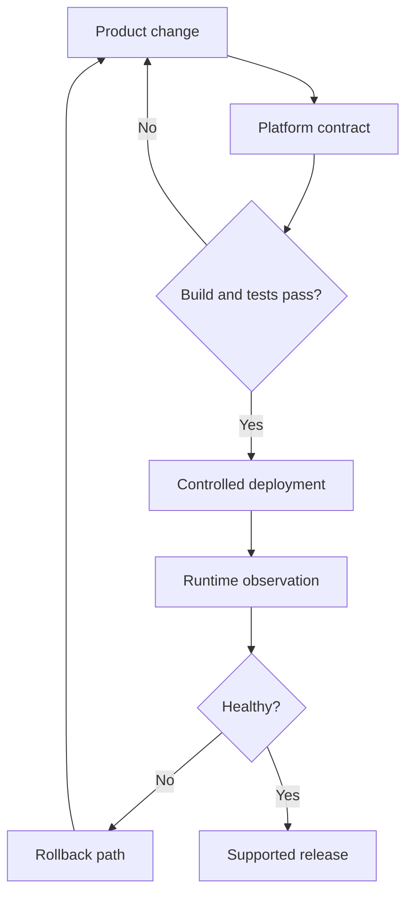

[← All work](https://github.com/J0UH) · [Product engineering](https://github.com/J0UH/product-engineering)

# Developer platform and delivery

The APIs, deployment paths, and recovery tools that help a product keep working as it changes.

A product accumulates operational knowledge quickly. Someone knows how an environment was configured, another person remembers a migration, and a release depends on a sequence of steps that is not quite written down.

The platform work spans different generations of services and deployment models. My focus is on turning that scattered knowledge into an understandable path for the next change.

## A release includes the way back

Builds and tests are part of delivery, but the work continues after deployment. Logs and runtime observations need to show whether the change is healthy. If it is not, the recovery path should be as deliberate as the release.

That shapes the API foundations, environment automation, integration tooling, and migration support. Architectural decisions also need a written reason when they change what future work will look like.

I like infrastructure that helps people move with confidence because they can see what is happening and know how to recover. The unusual case should still be possible, but it should not require rediscovering the whole platform.

## What the work covers

- API and service foundations
- Architectural decision records
- Environment and deployment automation
- Proxies, integration tools, and migration support
- Bug and release workflows
- Observability and operational recovery

A closer look at the technical flow

## Related work

- [Workflow automation infrastructure](https://github.com/J0UH/workflow-automation-infrastructure)
- [Product engineering](https://github.com/J0UH/product-engineering)

Working on a similar problem? [Tell me what you are building](mailto:ju@jomena.group?subject=Developer%20platform%20and%20delivery).

*This is a public account of the work. Source code and private operating details are not included in this repository.*
