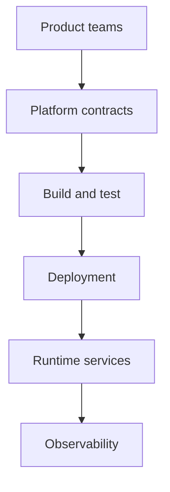

  

# Developer platform and delivery

Delivery infrastructure is product infrastructure. Teams move faster when APIs, environments, deployments, logs, decisions, and recovery paths form one understandable system.

[Discuss a similar system](mailto:ju@jomena.group?subject=Discuss%20Developer%20platform%20and%20delivery) | [Book a technical call](mailto:ju@jomena.group?subject=Book%20a%20technical%20call%20about%20Developer%20platform%20and%20delivery)

## The engineering problem

The platform work spanned several generations of services and deployment models. The challenge was reducing one-off knowledge while keeping enough flexibility for experiments, migrations, and live financial products.

## What the system covers

- API and service foundations
- Architectural decision records
- Environment and deployment automation
- Proxies, integration tools, and migration support
- Bug and release workflows
- Observability and operational recovery

## System shape

## Build notes

- Write down the tradeoff when a decision changes the shape of future work.
- Make the supported path easy and the exceptional path visible.
- Optimise for recovery time, not only deployment speed.

Built under the Aryze umbrella. The underlying source and company IP remain private and owned by Aryze. Delivery involved people across engineering, product, operations, compliance, and design. Open-source foundations retain their original attribution and licences.

## Talk through a similar problem

If you are trying to build, untangle, or ship a system in this area, [send me a note](mailto:ju@jomena.group?subject=I%20need%20help%20with%20Developer%20platform%20and%20delivery). If the problem needs a deeper technical conversation, [book a call by email](mailto:ju@jomena.group?subject=Book%20a%20technical%20call%20about%20Developer%20platform%20and%20delivery).
